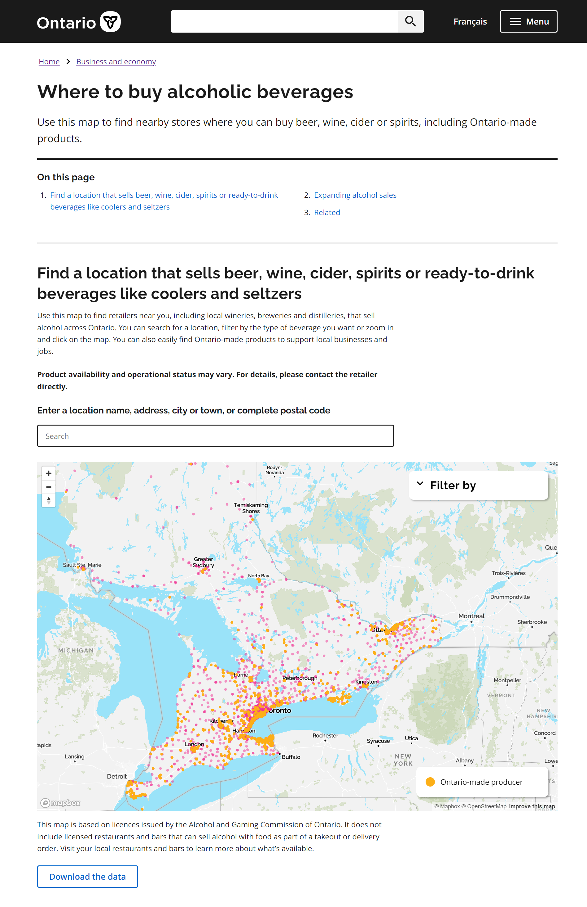

# Data Scientist

#### Technical Skills: Python, SQL, AWS, Snowflake, MATLAB

## Education
- Ph.D., Physics | The University of Texas at Dallas (_May 2022_)								       		
- M.S., Physics	| The University of Texas at Dallas (_December 2019_)	 			        		
- B.S., Physics | The University of Texas at Dallas (_May 2017_)

## Work Experience
**Data Scientist @ Toyota Financial Services (_June 2022 - Present_)**
- Uncovered and corrected missing step in production data pipeline which impacted over 70% of active accounts
- Redeveloped loan originations model which resulted in 50% improvement in model performance and saving 1 million dollars in potential losses

**Data Science Consultant @ Shawhin Talebi Ventures LLC (_December 2020 - Present_)**
- Conducted data collection, processing, and analysis for novel study evaluating the impact of over 300 biometrics variables on human performance in hyper-realistic, live-fire training scenarios
- Applied unsupervised deep learning approaches to longitudinal ICU data to discover novel sepsis sub-phenotypes

## Projects
### Alcoholic beverage map

During an LCBO strike in July 2024, the Ontario government rolled out a searchable and interactive map to help consumers find outlets to buy beer, wine, cider and spirits. For this project I was responsible for geocoding over 6,000 address locations for the map, as well as setting up web analytics and reporting.

