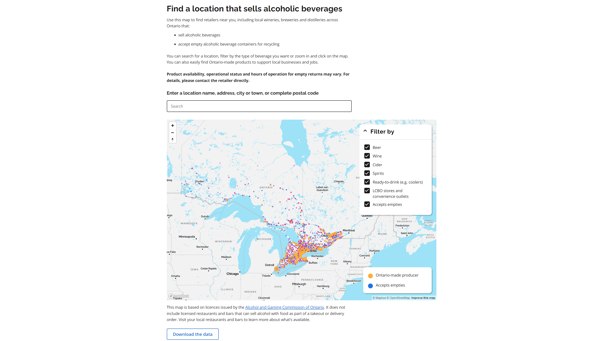
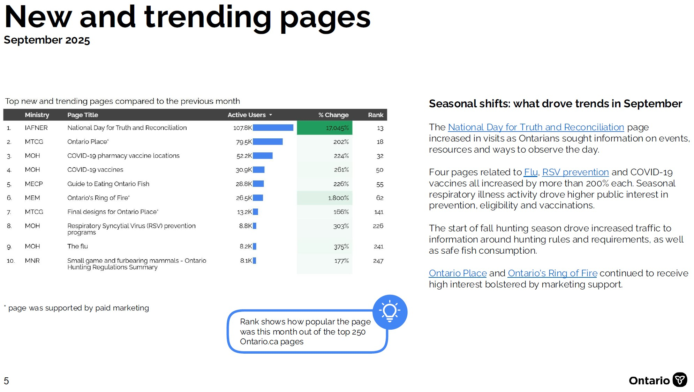

## Projects
### [Geocoding and web analytics for an Alcohol Retailer Map](alcohol-map.md)

During an LCBO strike in July 2024, the Ontario Government rolled out a searchable and interactive map to help consumers find outlets to buy beer, wine, cider and spirits. For this project I was responsible for geocoding over 6,000 address locations for the map, as well as setting up web analytics and reporting.

_Tools: JupyterLab, Python, Google Maps API, Google Tag Manager, Google Analytics 4, Looker Studio_

### [Automating executive insights: Ontario.ca monthly analytics report](monthly-reports.md)

I created an automated monthly analytics report for Ontario’s flagship website, Ontario.ca, to provide senior executives with data-driven insights into digital performance. The report helps leadership teams quickly understand key trends, public interests, and the impact of digital initiatives. It is distributed monthly to senior audiences, including the Premier’s Office, Ontario.ca Executive Table, and Directors of Communications.

_Tools: Python, pandas, NumPy, Google Colab, Google Analytics API, Google Analytics 4, Google Sheets, Looker Studio_

