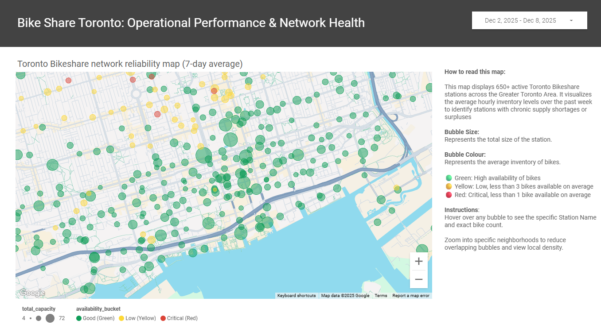
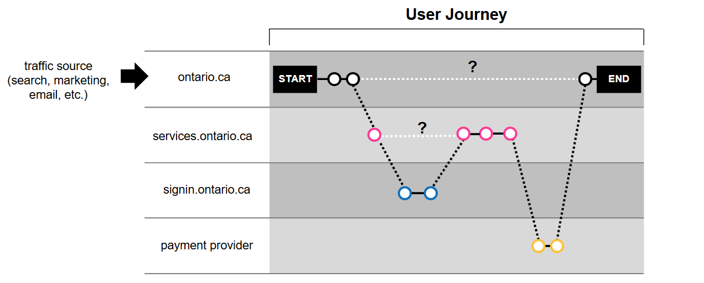
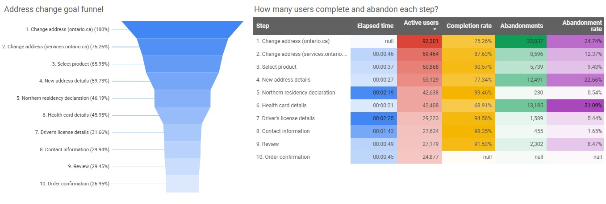

## Projects

### [1. Geocoding 9,000 addresses into a public map visited by 450k+ Ontarians](alcohol-map.md)

During an LCBO strike in July 2024, the Ontario Government rolled out a searchable and interactive map to help consumers find alternative alcohol retailers across the province. I led the geocoding of over 9,000 address locations for the map, as well as analytics implementation.

_Tools: Python, JupyterLab, Google Maps API, Google Tag Manager, Google Analytics 4, Looker Studio_

### [2. End-to-End Serverless Data Pipeline: Toronto Bike Share Analytics](bike-share-pipeline.md)

This project involved designing a fully automated, serverless data pipeline to capture real-time transit data from the Toronto Parking Authority. It moves away from manual data extraction to a cloud-native architecture, building a historical data warehouse in Google BigQuery and visualizing network performance in a live dashboard.

_Tools: Python (Pandas, Requests, Pandas-GBQ), SQL, dbt, GitHub Actions, Google BigQuery, Looker Studio_

### [3. Enterprise analytics: Tracking Full User Journeys & Optimizing Conversions](enterprise-analytics.md)

I led an enterprise initiative to implement a unified analytics system across all public facing Ontario.ca services, establishing a single, secure view of the end-to-end user journey. The platform now delivers deep insights into user movements and service drop-off points, standardizing data for product teams and executives.

_Tools: Google Tag Manager, Google Analytics 4, Looker Studio, HTML, JavaScript, Data Privacy Impact Assessment (PIA)_

### [4. Automating executive insights: Ontario.ca monthly analytics report](monthly-reports.md)

I created an automated monthly analytics report for Ontario’s flagship website, Ontario.ca. The report helps leadership teams quickly understand key trends, public interests, and the impact of marketing campaigns. It is distributed monthly to senior audiences, including the Premier’s Office, Ontario.ca Executive Table, and Directors of Communications.

_Tools: Python, pandas, NumPy, Google Colab, Google Analytics API, Google Analytics 4, Google Sheets, Looker Studio_

