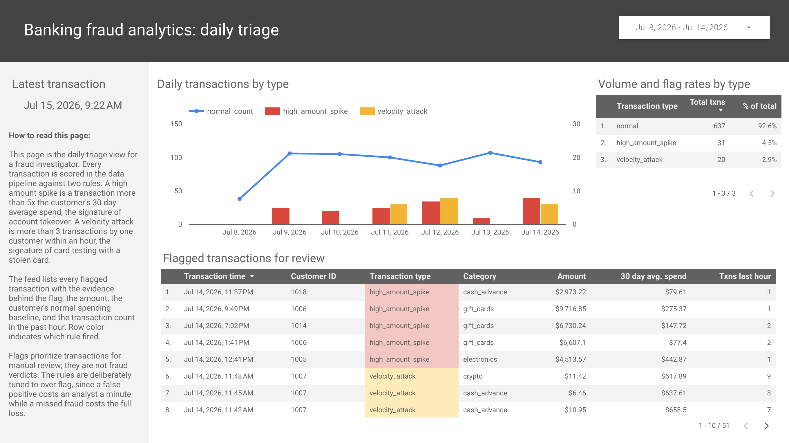
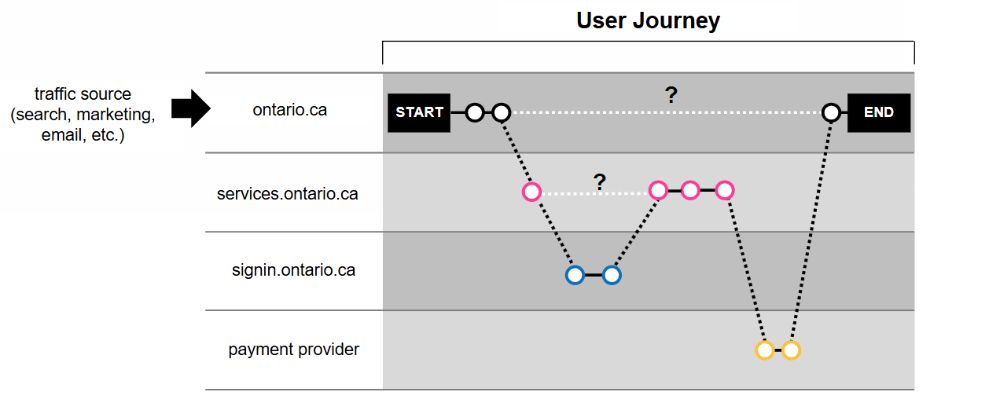
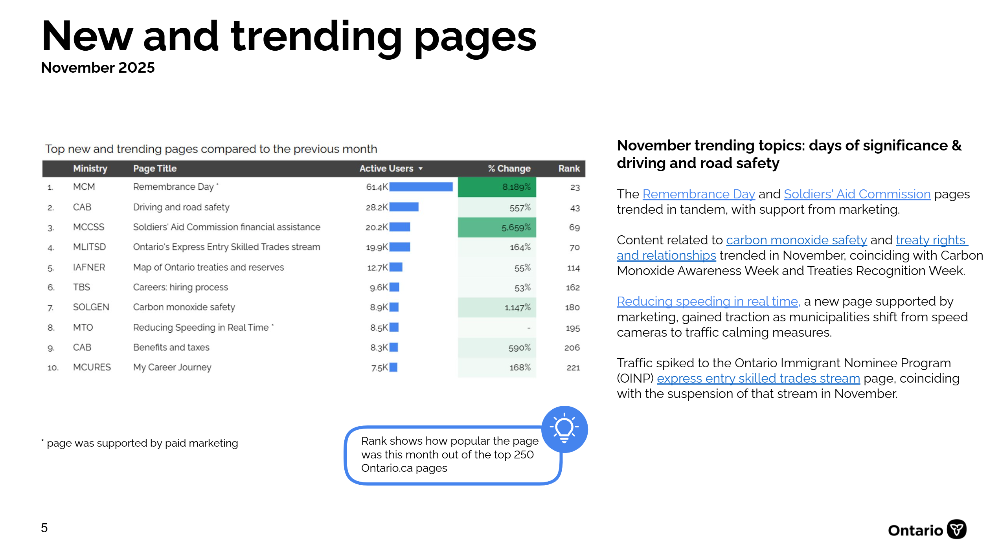
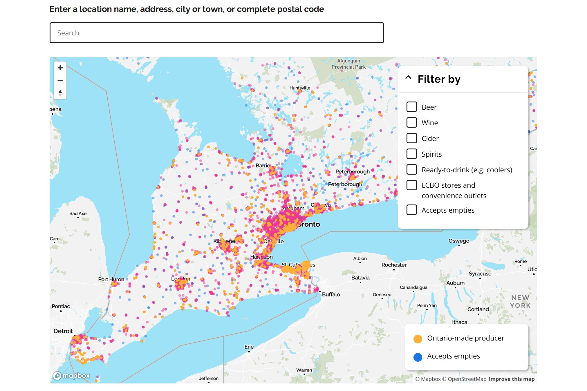

## Projects

### [1. Fintech analytics engineering: Detecting high-value banking fraud](banking-fraud-analytics.md)

I built a fully automated fraud detection pipeline that simulates how a bank monitors transactions for suspicious activity. Every morning it generates transactions seeded with two realistic fraud patterns, scores them against tested detection rules in dbt and BigQuery, and serves the results to a live triage dashboard for fraud investigators.

_Tools: Python, SQL, dbt (data build tool), Google BigQuery, GitHub Actions, Data Studio_

### [2. Serverless analytics engineering: Tracking Toronto's bike share network live](bike-share-pipeline.md)

A fully automated, serverless pipeline that captures live data from Toronto's bike share network every 2 hours. It ingests roughly 12,500 rows a day from a live city API into Google BigQuery, models them with version controlled SQL in Dataform, and powers a live dashboard tracking availability across 1,000+ stations.

_Tools: Python, SQL, Dataform, Google BigQuery, Google Cloud Scheduler, Google Cloud Run Functions, Data Studio_

### [3. Enterprise web analytics: Tracking full user journeys & optimizing marketing conversions](enterprise-analytics.md)

I led an enterprise initiative to implement a unified analytics system across all public facing Ontario.ca services, establishing a single, secure view of the end-to-end user journey. The platform now delivers deep insights into user movements and service drop-off points, standardizing data for product teams and executives.

_Tools: Google Tag Manager, Google Analytics 4, Looker Studio, HTML, JavaScript, Data Privacy Impact Assessment (PIA)_

### [4. Automating executive insights: Ontario.ca monthly analytics report](monthly-reports.md)

I created an automated monthly analytics report for Ontario’s flagship website, Ontario.ca. The report helps leadership teams quickly understand key trends, public interests, and the impact of marketing campaigns. It is distributed monthly to senior audiences, including the Premier’s Office, Ontario.ca Executive Table, and Directors of Communications.

_Tools: Python, pandas, NumPy, Google Colab, Google Analytics API, Google Analytics 4, Google Sheets, Data Studio_

### [5. Geocoding 9,000 addresses into a public map visited by 450k+ Ontarians](alcohol-map.md)

During an LCBO strike in July 2024, the Ontario Government rolled out a searchable and interactive map to help consumers find alternative alcohol retailers across the province. I led the geocoding of over 9,000 address locations for the map, as well as analytics implementation.

_Tools: Python, JupyterLab, Google Maps API, Google Tag Manager, Google Analytics 4, Data Studio_

