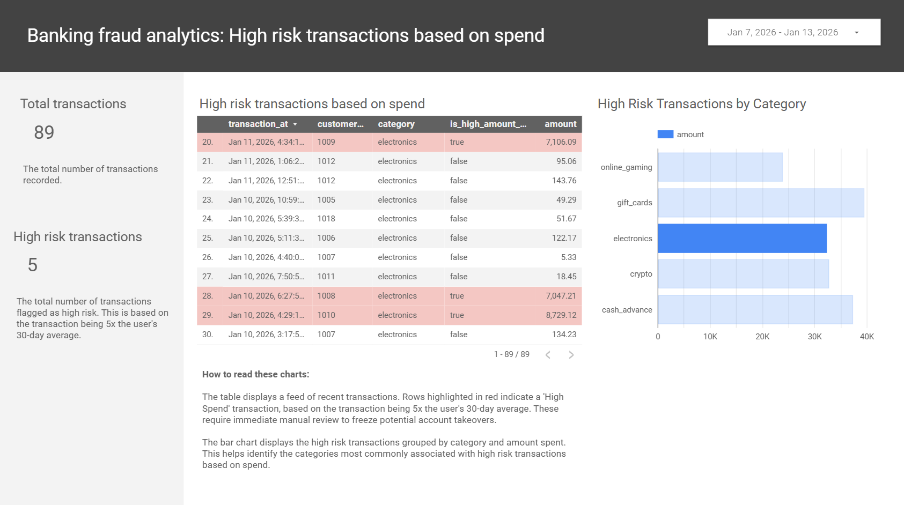

## Projects

### [1. Fintech data engineering: Detecting high-value banking fraud](banking-fraud-analytics.md)

This project is a fully automated system designed to detect financial fraud in real-time. I built a pipeline that takes raw banking transaction data, cleans it, and checks it for suspicious patterns like users spending unusually high amounts. The final result is a live dashboard that alerts fraud analysts to high-risk activity the moment it happens.

_Tools: Python, SQL, dbt (data build tool), GitHub Actions, Google BigQuery, Data Studio_

### [2. End-to-end serverless data pipeline: Toronto Bike Share analytics](bike-share-pipeline.md)

I designed and built a fully automated, serverless data pipeline that captures live data from Toronto’s bike share network every 2 hours and turns it into an automated dashboard. Raw data flows from a live city API into Google BigQuery, gets cleaned and modeled with version controlled SQL in Google Cloud Dataform, and is visualized in Data Studio. The system ingests roughly 12,500 rows a day across 1,000+ stations, maintains a rolling window of about 380,000 records, runs hands off, tests its own data quality on every run, and costs $0.00 per month.

_Tools: Python, SQL, Google BigQuery, Dataform, Google Cloud Scheduler, Google Cloud Run Functions, Data Studio_

### [3. Enterprise web analytics: Tracking full user journeys & optimizing marketing conversions](enterprise-analytics.md)

I led an enterprise initiative to implement a unified analytics system across all public facing Ontario.ca services, establishing a single, secure view of the end-to-end user journey. The platform now delivers deep insights into user movements and service drop-off points, standardizing data for product teams and executives.

_Tools: Google Tag Manager, Google Analytics 4, Looker Studio, HTML, JavaScript, Data Privacy Impact Assessment (PIA)_

### [4. Automating executive insights: Ontario.ca monthly analytics report](monthly-reports.md)

I created an automated monthly analytics report for Ontario’s flagship website, Ontario.ca. The report helps leadership teams quickly understand key trends, public interests, and the impact of marketing campaigns. It is distributed monthly to senior audiences, including the Premier’s Office, Ontario.ca Executive Table, and Directors of Communications.

_Tools: Python, pandas, NumPy, Google Colab, Google Analytics API, Google Analytics 4, Google Sheets, Data Studio_

### [5. Geocoding 9,000 addresses into a public map visited by 450k+ Ontarians](alcohol-map.md)

During an LCBO strike in July 2024, the Ontario Government rolled out a searchable and interactive map to help consumers find alternative alcohol retailers across the province. I led the geocoding of over 9,000 address locations for the map, as well as analytics implementation.

_Tools: Python, JupyterLab, Google Maps API, Google Tag Manager, Google Analytics 4, Data Studio_

