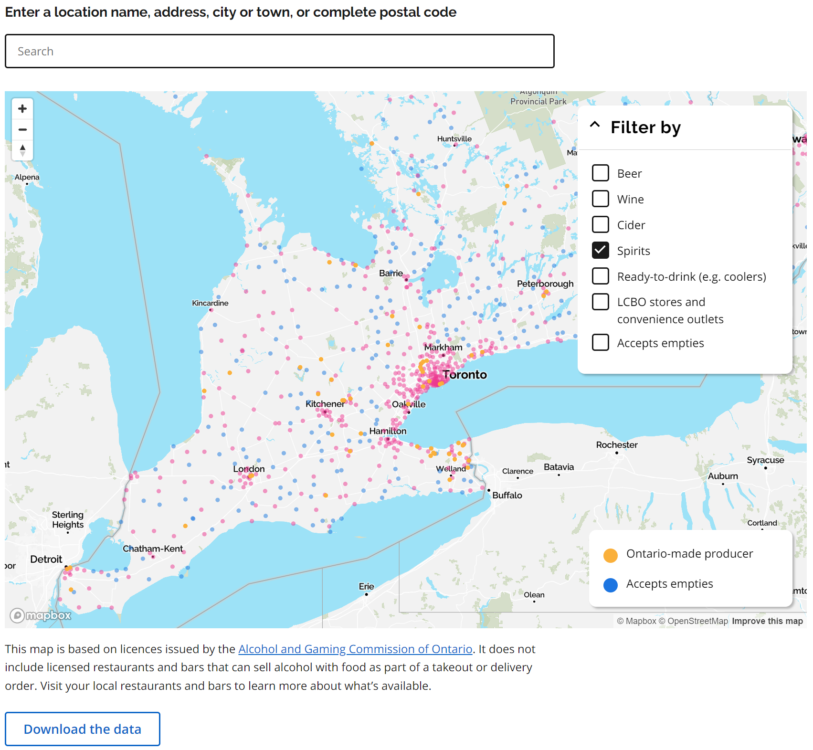
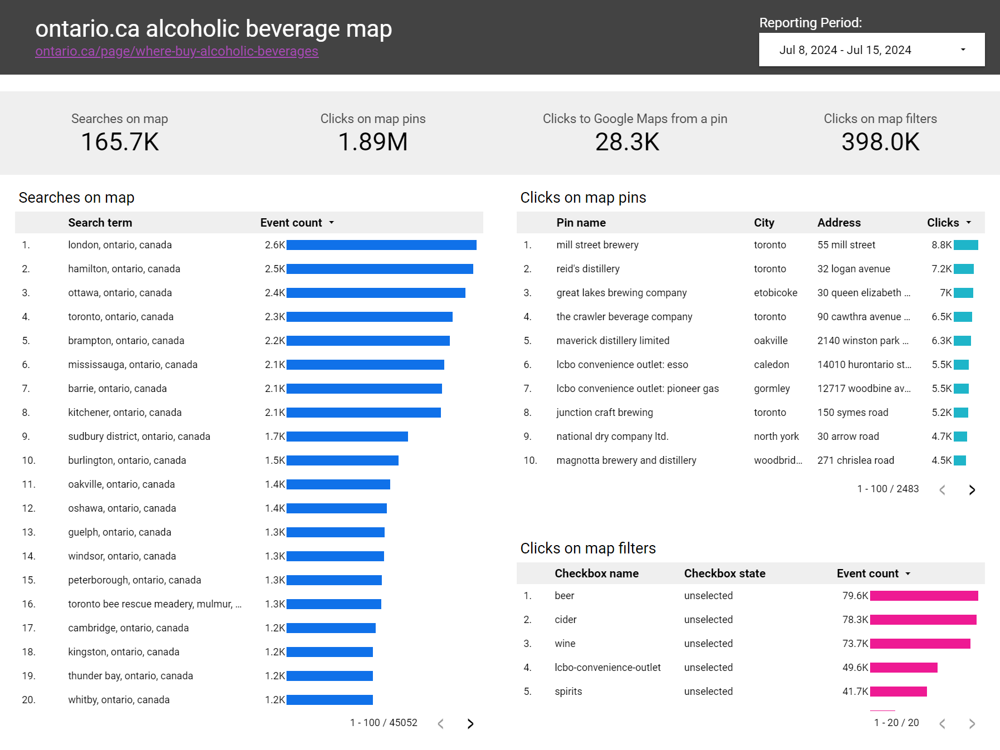
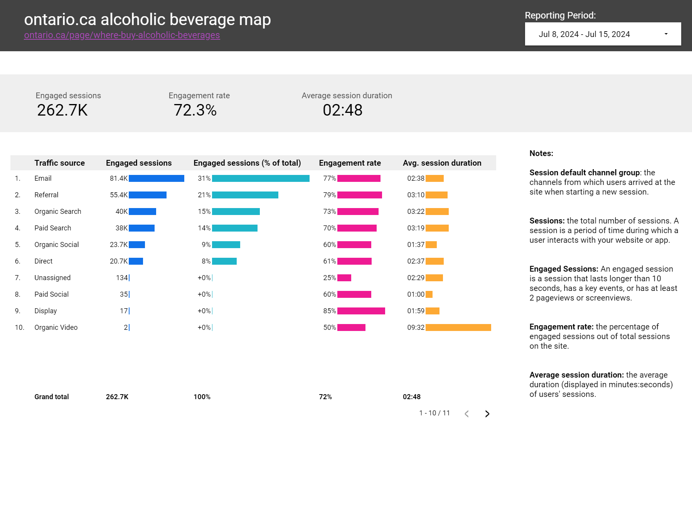

## Geocoding and web analytics for an Alcohol Retailer Map

### Summary:

During an LCBO strike in July 2024, the Ontario Government rolled out a searchable and interactive map to help consumers find outlets to buy beer, wine, cider and spirits. For this project I was responsible for geocoding over 6,000 address locations for the map, as well as setting up web analytics and reporting.

_Tools: JupyterLab, Python, Google Maps API, Google Tag Manager, Google Analytics 4, Looker Studio_



### Questions Answered:

- Is there a way we can automate the geocoding of addresses for the map, rather than doing in manually?
- How many users are visiting the map and viewing specific retailer locations?
- Can users navigate the map easily? (eg searching, using filters or directly clicking pins)
- What traffic sources are driving users to the map and what percent of those users are engaging with the content?

### Steps:

#### Geocoding data
In order to build the map our team was provided a dataset of over 6,000 alcohol retailer addresses in Ontario. It is based on licences issued by the Alcohol and Gaming Commission of Ontario. The addresses in the dataset did not include latitude and longitude coordinates, so locations could not be added to a map. 

I used Jupyter Notebooks and Python to write a script calling the Google Maps API. The script provides the API a dataset of addresses and returns a new dataset with their latitude and longitude coordinates in new columns. An example of the updated dataset looked like this:

| full_address | latitude | longitude |
| -------- | ------- | ------- |
| 110 Chandler Cresent, Peterborough, K9J6X4, ON | 44.304528 | -78.372458 |
| 450 Trudeau Drive, Sarnia, N7S4V1, ON | 42.960762 | -82.357230 |
| 2611 Muskoka Road 117, Baysville, P0B1A0, ON | 45.146350 | -79.121450 |

The geocoding python script can be [viewed on GitHub here](https://github.com/justinduckett/google-maps-geocoding-script).

#### Setting up web analytics
To set up web analytics I provided developers javascript code snippets in order to track custom events. These code snippets fire whenever certain actions take place on the page, like clicking a map pin or using the map filters. The code snippets pass in additional data to Google Tag Manager via a data layer, that we then use to create custom events. An example of a data layer code snippet to track map pin clicks looks like this:

```
<script>
 window.dataLayer = window.dataLayer || [];
 window.dataLayer.push({
 'event': 'click_map_pin',
 'product_name': 'alcoholic beverages map', // pass in the product name as a constant value
 'map_pin_title': 'xxxxxx', // pass in the name of the retail location
 'map_pin_location': 'xxxxx' // pass in the city of the pin location
 });
</script>
```

After the code snippets are added to the page, I set up custom event tags in Tag Manager and configured new event parameters in Google Analytics 4. I also built a dashboard visualizing key data in Looker Studio. Screenshots of the dashboard can be viewed below.






### Results:

- I successfully integrated the Google Maps Geocoding API to accurately add latitude and longitude coordinates for over 6000 addresses, ensuring precise location data for improved user experience.
- Web analytics data provided insights on product features, including how users were filtering for location results most often. This allowed the product team to make iterative improvements to the map.
- Over 450,000 users visited the map and 3 million location pins were clicked in 2024. The map had a very high engagement rate over 65%.

### Project resources:

- View the [geocoding python script on GitHub](https://github.com/justinduckett/google-maps-geocoding-script)
- View the [Alcoholic Beverage map on ontario.ca](https://www.ontario.ca/page/where-buy-alcoholic-beverages)
- View the full map [dataset on the Ontario Data Catalouge](https://data.ontario.ca/dataset/alcohol-sales-in-retail-stores)
- View a PDF export of the web analytics dashboard

### Media Coverage:

- News Release: [Let’s Make it an Ontario-Made Summer!](https://news.ontario.ca/en/release/1004813/lets-make-it-an-ontario-made-summer)
- CBC News: [Ford rolls out map to help find booze retailers amid LCBO strike](https://www.cbc.ca/news/canada/toronto/online-map-alcohol-sales-ontario-lcbo-strike-1.7257144)
- CTV News: [Ontario launches interactive map of retail locations selling alcohol during LCBO strike](https://www.ctvnews.ca/toronto/article/new-map-shows-2300-ontario-locations-where-you-can-still-buy-alcohol-during-lcbo-strike/)
