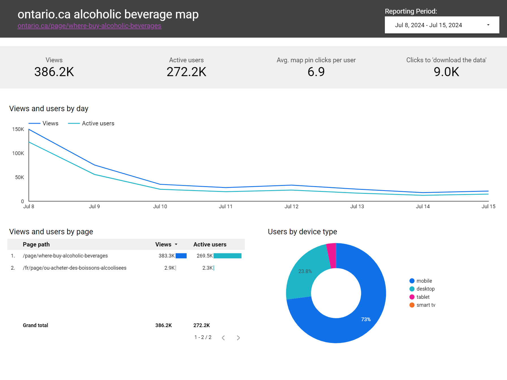

## Geocoding and web analytics for an Alcohol Retailer Map

### Summary:

During an LCBO strike in July 2024, the Ontario Government launched a searchable, interactive map to help consumers find alternative alcohol retailers across the province. I led the geocoding and analytics implementation for this project. The map became one of the most visited pages on Ontario.ca, supporting public awareness and service continuity during a province-wide labour disruption.


### Tools used:

- **Python and JupyterLab** – for data cleaning and geocoding automation
- **Google Maps Geocoding API** – to convert address data into geographic coordinates
- **Google Tag Manager** – to configure and deploy custom tracking events
- **Google Analytics 4 (GA4)** – to measure engagement and user behaviour
- **Looker Studio** – to visualize user interaction data and share dashboards with stakeholders

### Purpose:

The goal of this project was to rapidly develop a reliable, data-driven mapping solution that helped Ontarians find nearby retailers during the LCBO strike. My responsibilities included automating the geocoding of thousands of retail locations to ensure accurate map placement and implementing analytics tracking to understand how users interacted with the map through searches, filters, and pin clicks.

### Steps taken to complete the work:

**1. Automated Geocoding Workflow**

I developed a Python script in JupyterLab that connected to the Google Maps Geocoding API, automatically generating latitude and longitude coordinates for more than 6,000 retailer addresses provided by the Alcohol and Gaming Commission of Ontario. This approach eliminated manual data entry and ensured every retail location could be precisely displayed on the map. 

An example of the updated dataset below:

| full_address | latitude | longitude |
| -------- | ------- | ------- |
| 110 Chandler Cresent, Peterborough, K9J6X4, ON | 44.304528 | -78.372458 |
| 450 Trudeau Drive, Sarnia, N7S4V1, ON | 42.960762 | -82.357230 |
| 2611 Muskoka Road 117, Baysville, P0B1A0, ON | 45.146350 | -79.121450 |

The geocoding python script can be [viewed on GitHub here](https://github.com/justinduckett/google-maps-geocoding-script)

**2. Custom Web Analytics Setup**

I collaborated with developers to embed JavaScript snippets that passed user interaction data (such as map pin clicks, filter selections, and searches) into the dataLayer for use in Google Tag Manager. These snippets were configured into custom GA4 events that captured parameters like location name, city, and interaction type.

An example of a data layer code snippet:

```
<script>
 window.dataLayer = window.dataLayer || [];
 window.dataLayer.push({
 'event': 'click_map_pin',
 'product_name': 'alcoholic beverages map', // pass in the product name as a constant value
 'map_pin_title': 'xxxxxx', // pass in the name of the retail location
 'map_pin_location': 'xxxxx' // pass in the city of the pin location
 });
</script>
```

**3. Interactive Dashboards and Reporting**

Using Looker Studio, I designed dashboards that visualized engagement metrics and user behavior patterns. These dashboards allowed the product team to monitor performance in real time and refine the map experience based on usage trends.

Screenshots of the dashboard can be viewed below:




### Results and impact:

The Alcohol Retailer Map became a high-traffic, high-engagement product during a critical period for the province.

Key outcomes include:

- **Automated geocoding of 6,000+ retailer locations**, ensuring accuracy and speed in launching the public-facing map
- **200+ hours of manual data work eliminated** through Python automation (based on 2 minutes per location manually looked up)
- **Over 450,000 users visited the map in 2024**, generating 3 million location pin interactions and an engagement rate above 65 percent
- Analytics insights revealed how users filtered and searched for locations most effectively, informing design updates and improving usability
- The project demonstrated how combining **data engineering, analytics, and storytelling** can quickly support high-profile digital government initiatives

### Project resources:

- View the [geocoding python script on GitHub](https://github.com/justinduckett/google-maps-geocoding-script)
- View the [Alcoholic Beverage map on ontario.ca](https://www.ontario.ca/page/where-buy-alcoholic-beverages)
- View the full map [dataset on the Ontario Data Catalouge](https://data.ontario.ca/dataset/alcohol-sales-in-retail-stores)
- View a PDF export of the web analytics dashboard

### Media Coverage:

- News Release: [Let’s Make it an Ontario-Made Summer!](https://news.ontario.ca/en/release/1004813/lets-make-it-an-ontario-made-summer)
- CBC News: [Ford rolls out map to help find booze retailers amid LCBO strike](https://www.cbc.ca/news/canada/toronto/online-map-alcohol-sales-ontario-lcbo-strike-1.7257144)
- CTV News: [Ontario launches interactive map of retail locations selling alcohol during LCBO strike](https://www.ctvnews.ca/toronto/article/new-map-shows-2300-ontario-locations-where-you-can-still-buy-alcohol-during-lcbo-strike/)
