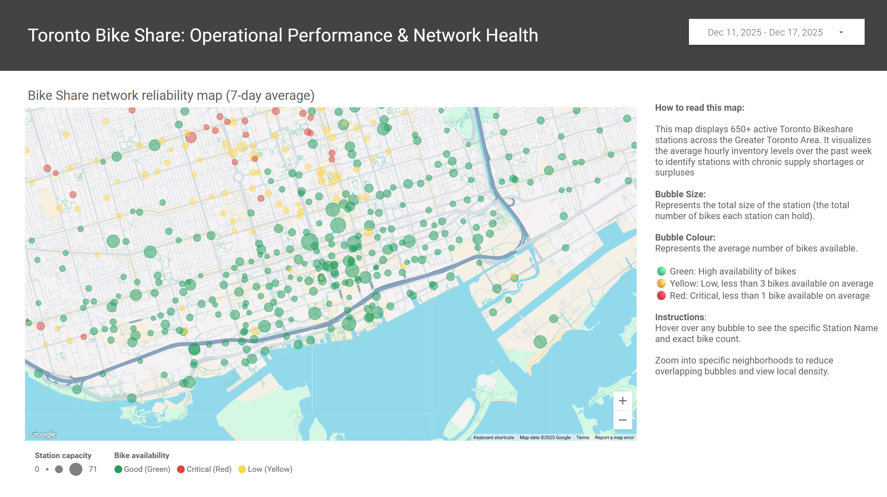
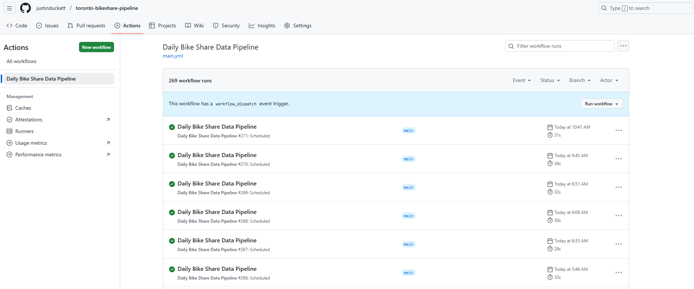
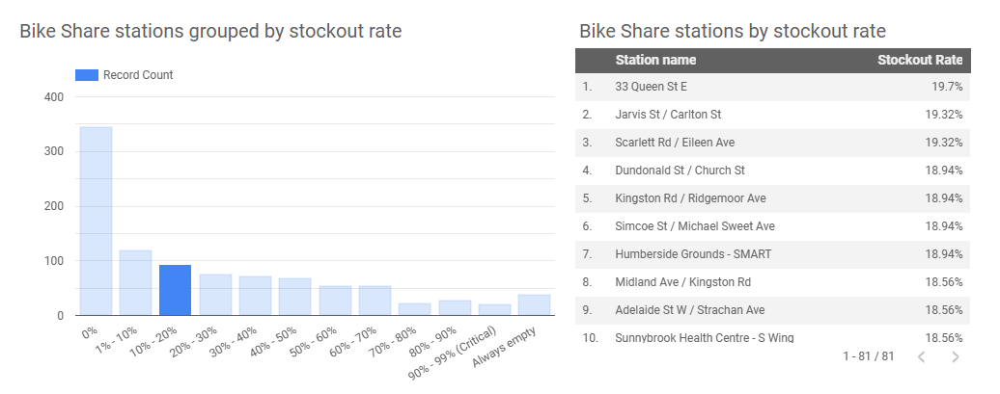

## End-to-End Serverless Data Pipeline: Toronto Bike Share Analytics

### Summary 
This project involved designing a fully automated, serverless data pipeline to capture real-time transit data from the Toronto Parking Authority. It utilizes a modern **ELT (Extract, Load, Transform)** architecture, ingesting raw API data into Google BigQuery and using **dbt (data build tool)** to transform it into trusted, historical records for a live dashboard.




### Tools used

- **Data Ingestion:** Python (Pandas, Requests, Pandas-GBQ)

- **Transformation:** dbt Core (SQL Modeling, Automated Testing)

- **Orchestration:** GitHub Actions (CI/CD, Cron Scheduling)

- **Cloud Warehousing:** Google BigQuery

- **Visualization:** Looker Studio 

### Purpose of the work 
I built this project to expand my technical analytics skillset with modern data engineering. Specifically, I wanted to demonstrate:

- **Engineer robust pipelines:** Moving away from manual exports to building "set and forget" pipelines using Python and cloud tools.

- **Implement software best practices:** Treating data as code by using dbt to version-control my SQL logic and automate data quality testing.

- **Solve real-world data problems:** Taking raw, transient API data and transforming it into a permanent historical record for trend analysis.

### Key project phases

**1. Data Ingestion (Python):** 

I wrote a Python script to handle the raw data extraction.

- Extracting live station data (status and metadata) from the Toronto Bike Share GBFS API.
- Merging disparate JSON feeds and enriching inventory counts with geospatial coordinates.
- Loading the raw data into Google BigQuery using an append-only strategy to preserve history.

**2. Transformation & Modeling (dbt):** 

I implemented dbt to manage the transformation layer, moving complex logic out of the BI tool and into version control.

- Modular SQL: I refactored large, messy queries into reusable data models (e.g., ```active_fleet_size```, ```station_health_score```).
- Automated Testing: I configured tests to run every hour, ensuring no duplicate station IDs or invalid values ever reach the dashboard.
- Documentation: I defined table schemas and descriptions in code, creating a self-documenting data dictionary.

**3. Serverless Orchestration** 

I replaced traditional, heavy schedulers (like Airflow) with GitHub Actions for a lightweight, serverless approach.

- The pipeline automatically installs dependencies, authenticates securely using dynamic keys, and executes the Python ingestion followed by the dbt transformation.
- I utilized GitHub Secrets to manage cloud credentials, ensuring high security without hard-coding passwords.



**4. Advanced Analytics & Visualization:** 

By doing the heavy lifting in dbt, the visualization layer became lightweight and fast.

- I pre-calculated "Stockout Rates" in the data warehouse, allowing Looker Studio to visualize station failure histograms instantly without lagging.
- I created logic to filter out 'Zombie Stations' (inactive units), ensuring the analysis focuses on active fleet performance.



**SQL Example:** 

This is an example of a SQL query I wrote to categorize stations based on stockout rate. This helps group stations that are completely empty from those that are critically failing but operational. 

```
SELECT
  name,
  stockout_rate,
  CASE
    WHEN stockout_rate = 1.0 THEN 'Always empty'
    WHEN stockout_rate >= 0.9 THEN '90% - 99% (Critical)'
    WHEN stockout_rate >= 0.8 THEN '80% - 90%'
    WHEN stockout_rate >= 0.7 THEN '70% - 80%'
    WHEN stockout_rate >= 0.6 THEN '60% - 70%'
    WHEN stockout_rate >= 0.5 THEN '50% - 60%'
    WHEN stockout_rate >= 0.4 THEN '40% - 50%'
    WHEN stockout_rate >= 0.3 THEN '30% - 40%'
    WHEN stockout_rate >= 0.2 THEN '20% - 30%'
    WHEN stockout_rate >= 0.1 THEN '10% - 20%'
    WHEN stockout_rate >= 0.01 THEN '1% - 10%'
    ELSE '0%'
  END as reliability_bucket
FROM (
  SELECT
    name,
    AVG(CASE WHEN num_bikes_available = 0 THEN 1.0 ELSE 0.0 END) as stockout_rate
  FROM
    `toronto-bikeshare-analytics.bike_data.status_history`
  GROUP BY
    name
)
```
### Results and impact

- **Data Trust & Quality:** Integrated automated testing via dbt, ensuring 100% confidence in the data accuracy before it reaches stakeholders.

- **Zero-Touch Automation:** Successfully deployed a "set and forget" pipeline that runs 24/7. The system self-corrects and alerts on failure.

- **Cost Optimization:** Architected the entire solution to run for $0.00/month by leveraging the Free Tier limits of Google Cloud and GitHub Actions, demonstrating high-value delivery with zero infrastructure cost.

- **Operational Insight:** The analysis identified that ~8% of the network consists of ‘Zombie Stations’, providing a prioritized target list for operational rebalancing teams.


### Links

- <a href="{{ 'https://github.com/justinduckett/toronto-bikeshare-pipeline' | relative_url }}" target="_blank" rel="noopener noreferrer">
  Link to the Bike Share Toronto GitHub Repository
</a>

- <a href="{{ 'https://lookerstudio.google.com/s/tGmMFc8I_jU' | relative_url }}" target="_blank" rel="noopener noreferrer">
  Link to the Bike Share Toronto Looker Studio report
</a>


