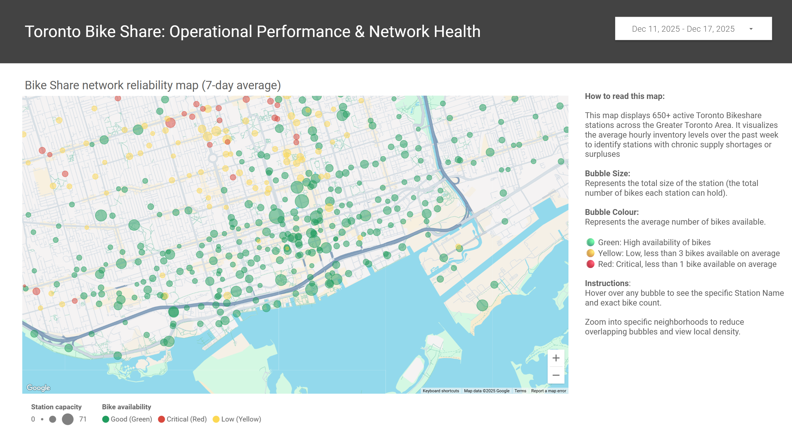
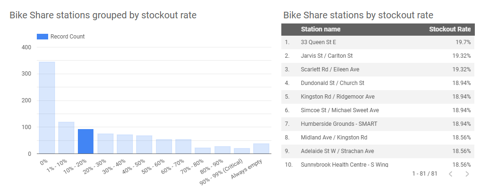

## End-to-End Serverless Data Pipeline: Toronto Bike Share Analytics

### Summary 
This project involved designing a fully automated, serverless data pipeline to capture real-time transit data from the Toronto Parking Authority. It utilizes a modern ELT (Extract, Load, Transform) architecture, automatically ingesting raw API data into Google BigQuery and using Google Cloud Dataform to transform it into clean, historical records for a live public dashboard. 

<p>
  <a href="{{ 'https://lookerstudio.google.com/s/tGmMFc8I_jU' | relative_url }}" target="_blank" rel="noopener noreferrer">
    Link to the Toronto Bike Share Looker Studio report
  </a>
</p>




### Tools used

- _Python (Pandas, Requests)_: Data Ingestion
- _GitHub Actions (Cron scheduling)_: Automation & Scheduling
- _Google BigQuery_: Cloud Storage & Warehousing
- _Google Cloud Dataform (SQL, Automated Testing)_: Transformation & Modeling
- _Data Studio_: Advanced Analytics & Visualization

### Purpose of the work 
I built this project to expand my digital analytics background into modern analytics engineering. Specifically, I wanted to demonstrate how to: 

- **Engineer robust pipelines:** Moving away from manual exports to building "set and forget" pipelines using Python and cloud tools.
- **Implement software best practices:** Treating data as code by using dbt to version-control my SQL logic and automate data quality testing.
- **Solve real-world data problems:** Taking raw, transient API data and transforming it into a permanent historical record for trend analysis.

### Key project phases

**1\. The Data Source:** 

The pipeline begins with live transit data provided by the Toronto Bike Share API. Because this data arrives as messy, raw JSON code and only shows a snapshot in time, it needed to be captured continuously. 

**2\. Data Ingestion (Python):** 

I wrote a Python script to act as the "worker" that extracts this raw data.
- It authenticates with the public API and pulls the live station status and metadata.
- It merges different JSON feeds together and enriches the bike inventory counts with geographic mapping coordinates.

**3\. Cloud Storage (Google BigQuery):** 

Once the Python script gathers the data, it loads it untouched into Google BigQuery using an append-only strategy. This acts as our secure data warehouse, instantly turning fleeting, temporary API data into a permanent historical record.

**4\. Transformation & Modeling (Dataform):** 

I used Google Cloud Dataform to handle the transformation layer, moving complex logic out of the dashboard and into version-controlled code.
- Modular SQL: I broke large, messy queries into smaller, reusable tables (e.g., active_fleet_size, station_health_score).
- Automated Testing: I configured assertions to check for "bad data." If a duplicate station ID or a blank value is detected, it is flagged before it ever reaches the dashboard.
- Documentation: I defined table schemas and descriptions directly in the code, creating a self-updating data dictionary.

**5\. Serverless Scheduling & Automation (GitHub Actions):** 

Instead of deploying heavy, expensive orchestration servers (like Apache Airflow), I utilized a lightweight, 100% serverless approach to keep costs at zero.
- GitHub Actions acts as a timer, waking up every 4 hours to run the Python ingestion script. It securely authenticates with Google Cloud using hidden credentials (Secrets).
- Dataform's built-in scheduler automatically takes over afterward, running the SQL transformations to clean the data once it lands in BigQuery.

**6\. Advanced Analytics & Visualization (Looker Studio):** 

Because Dataform does the "heavy lifting" in the data warehouse, the Looker Studio dashboard remains incredibly fast and responsive for the end-user.
- I pre-calculated "Stockout Rates" (how often a station is empty) directly in the database, allowing the dashboard to instantly visualize station failure trends.
- I created logic to filter out 'Zombie Stations' (broken or inactive units) so the analysis only focuses on the true, active fleet.



**SQL Example:** 

This is an example of a SQL query I wrote to categorize stations based on how often they are completely empty. This helps the business easily separate stations that are functioning normally from those that are critically failing. 

```
SELECT
  name,
  stockout_rate,
  CASE
    WHEN stockout_rate = 1.0 THEN 'Always empty'
    WHEN stockout_rate >= 0.9 THEN '90% - 99% (Critical)'
    WHEN stockout_rate >= 0.8 THEN '80% - 90%'
    WHEN stockout_rate >= 0.7 THEN '70% - 80%'
    WHEN stockout_rate >= 0.6 THEN '60% - 70%'
    WHEN stockout_rate >= 0.5 THEN '50% - 60%'
    WHEN stockout_rate >= 0.4 THEN '40% - 50%'
    WHEN stockout_rate >= 0.3 THEN '30% - 40%'
    WHEN stockout_rate >= 0.2 THEN '20% - 30%'
    WHEN stockout_rate >= 0.1 THEN '10% - 20%'
    WHEN stockout_rate >= 0.01 THEN '1% - 10%'
    ELSE '0%'
  END as reliability_bucket
FROM (
  SELECT
    name,
    AVG(CASE WHEN num_bikes_available = 0 THEN 1.0 ELSE 0.0 END) as stockout_rate
  FROM
    `toronto-bikeshare-analytics.bike_data.status_history`
  GROUP BY
    name
)
```

### Results and impact

- **Data Trust & Quality:** By integrating automated testing via Dataform, stakeholders can have 100% confidence in the dashboard's accuracy. 
- **Zero-Touch Automation:** Successfully deployed a reliable pipeline that runs silently in the background every 4 hours, pulling critical data with zero manual intervention required.
- **Cost Optimization:** Architected the entire solution to run for $0.00/month by strictly leveraging the free-tier limits of Google Cloud and GitHub Actions. This demonstrates a strong ability to deliver high-value engineering with zero infrastructure overhead. 
- **Operational Insight:** The transformed data successfully identified that ~8% of the network consisted of "Zombie Stations," providing a clear, prioritized target list for operational rebalancing teams. 


### Links

- <a href="{{ 'https://github.com/justinduckett/toronto-bikeshare-pipeline' | relative_url }}" target="_blank" rel="noopener noreferrer">
  Link to the Bike Share Toronto GitHub Repository
</a>

- <a href="{{ 'https://lookerstudio.google.com/s/tGmMFc8I_jU' | relative_url }}" target="_blank" rel="noopener noreferrer">
  Link to the Bike Share Toronto Looker Studio report
</a>


