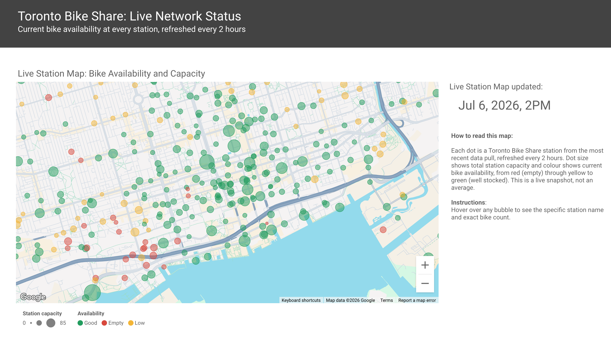
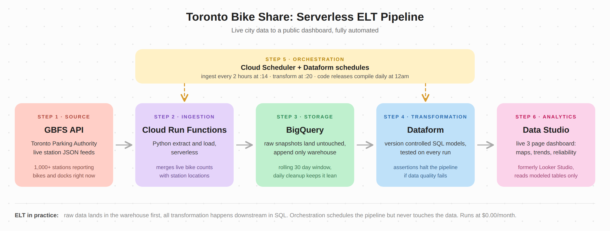
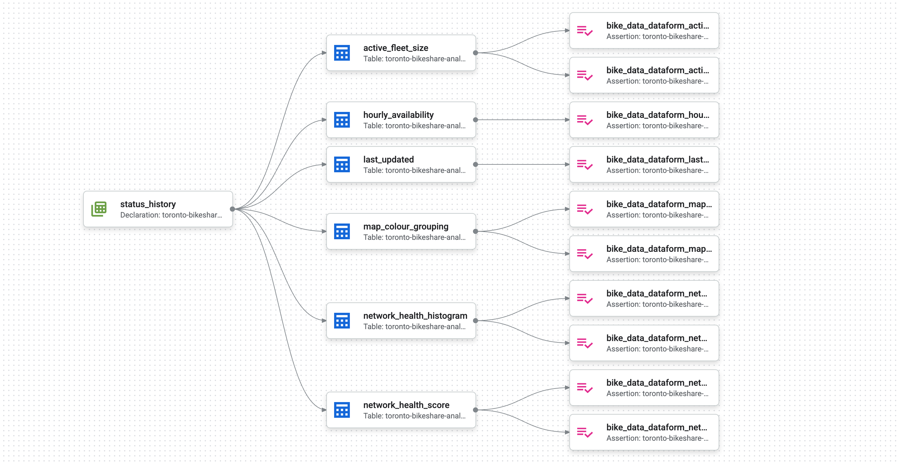
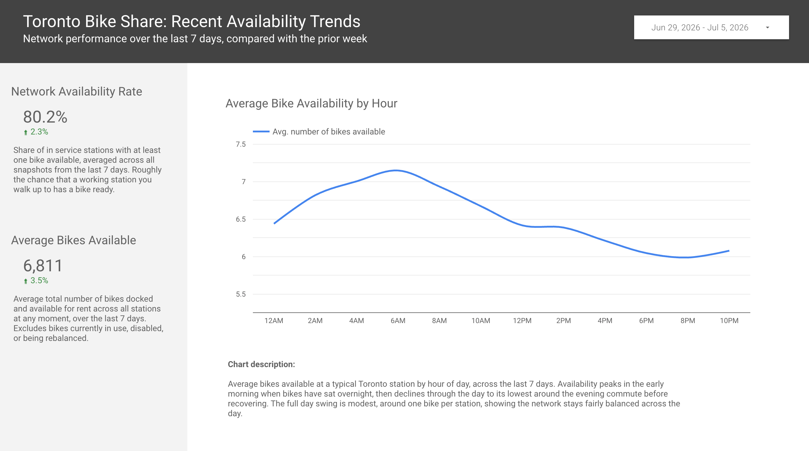
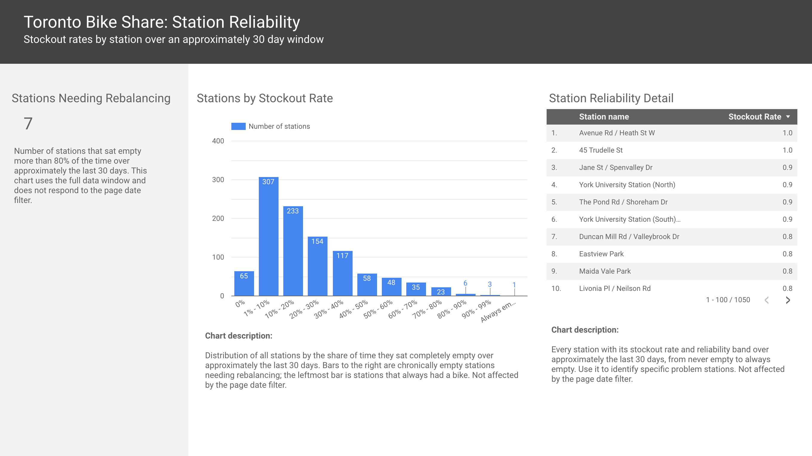

# End to End Serverless Data Pipeline: Toronto Bike Share Analytics

### Summary

I designed and built a fully automated, serverless data pipeline that captures live data from Toronto's bike share network every 2 hours and turns it into a public, self updating dashboard. Raw data flows from a live city API into Google BigQuery, gets cleaned and modeled with version controlled SQL in Google Cloud Dataform, and is visualized in Data Studio (formerly Looker Studio). The system ingests roughly 12,500 rows a day across 1,000+ stations, maintains a rolling window of about 380,000 records, runs hands off, tests its own data quality on every run, and costs $0.00 per month.



- [Live Data Studio dashboard](https://lookerstudio.google.com/reporting/ee66c00f-c017-4a8d-9249-72a67b1ba3a6)
- [GitHub repository](https://github.com/justinduckett/toronto-bikeshare-pipeline)

### Why I built this

My background is in digital analytics. I built this project to extend that foundation into analytics engineering, the discipline that sits between data analysis and data engineering. Specifically, I wanted hands on experience with three things:

- **Building pipelines, not exports.** Replacing manual data pulls with a "set and forget" system that ingests, cleans, and serves data automatically.
- **Treating data as code.** Version controlling every SQL transformation in Git, with automated tests that stop bad data before it reaches a dashboard.
- **Solving a real data problem.** The bike share API only shows the current moment. By capturing snapshots every 2 hours, the pipeline turns fleeting data into a historical record you can actually analyze.

### How it works

I structured the project around the standard components of modern data infrastructure, following the ELT (Extract, Load, Transform) approach: land the raw data in the warehouse first, then transform it there.



**1. Data source.** Toronto's bike share network publishes live station data through a public API using the global GBFS standard, the same format used by bike share systems worldwide. It reports how many bikes and docks each of the city's 1,000+ stations has right now.

**2. Ingestion.** A Python script fetches the live feeds, merges bike counts with station locations, and loads the result into the warehouse. It runs serverlessly on Google Cloud Run Functions, woken every 2 hours by Cloud Scheduler. No servers to maintain, nothing to babysit.

**3. Storage.** Google BigQuery acts as the data warehouse. Raw snapshots land untouched in an append only table, building the historical record. A scheduled cleanup keeps a rolling 30 day window, which keeps storage inside the free tier.

**4. Transformation and modeling.** This is the analytics engineering core. Google Cloud Dataform turns the raw snapshots into clean, purpose built tables using version controlled SQL. Each table answers one question: bike availability by hour of day, the live status of every station, each station's reliability over 30 days. Every model carries automated assertions, tests that run on every execution and halt the pipeline if the data violates expectations, like duplicate stations or missing values.



**5. Orchestration.** Ingestion and transformation run in a fixed sequence every 2 hours: data lands at 14 minutes past the hour, and the SQL models run at 20 past. The transformation code itself is compiled into a release once daily at midnight, a deliberate separation between how often the data refreshes and how often the code changes. If a data quality test fails, the run stops and the dashboard keeps serving the last good data instead of broken numbers.

**6. Analytics and visualization.** A three page Data Studio dashboard serves the results, organized by time horizon: a live network map refreshed every 2 hours, recent 7 day trends with week over week comparisons, and 30 day station reliability rankings.



### Problems I solved along the way

Real pipelines break in instructive ways. Two examples from this build:

- **A timezone bug that only showed up in the charts.** The hourly chart displayed impossible odd hours. The root cause was a hardcoded timezone offset hidden in a dashboard calculated field, which was wrong half the year because of daylight saving. I fixed it by applying a core principle: store timestamps in UTC, and convert to local time once, in the SQL modeling layer, using timezone aware functions that handle daylight saving automatically.
- **Code that was merged but not deployed.** New models stopped appearing in scheduled runs. The cause was Dataform's release configuration, which compiles code snapshots on its own schedule, running stale code. Debugging it taught me the difference between code being merged and code being live, a distinction every production data system has.

### Results

- **Zero touch automation.** The pipeline runs 12 cycles a day without manual intervention, capturing 1,000+ stations per cycle, roughly 12,500 rows daily, into a rolling window of about 380,000 records.
- **Trustworthy by design.** All 6 SQL models carry automated assertions that test data quality on every run, and every chart description was verified against what the SQL actually computes.
- **Operational insight.** The reliability analysis identifies chronically empty stations. At the time of writing, 10 stations sat empty more than 80% of the time, a prioritized target list for rebalancing crews.
- **Zero cost.** The full system runs at $0.00 per month on Google Cloud free tier resources.



### Example: the station reliability model

One SQL model calculates each station's "stockout rate," the share of time it sits completely empty, and groups stations into reliability bands:

```sql
WITH station_stats AS (
  SELECT
    station_id,
    ANY_VALUE(name) AS name,
    AVG(CASE WHEN num_bikes_available = 0 THEN 1.0 ELSE 0.0 END) AS stockout_rate
  FROM ${ref("status_history")}
  WHERE name IS NOT NULL
  GROUP BY station_id
)

SELECT
  *,
  CASE
    WHEN stockout_rate = 0 THEN '0%'
    WHEN stockout_rate <= 0.10 THEN '1-10%'
    WHEN stockout_rate <= 0.50 THEN '10-50%'
    WHEN stockout_rate < 1.0 THEN '50-99%'
    ELSE 'Always empty'
  END AS reliability_bucket
FROM station_stats
```

The `AVG(CASE WHEN ...)` pattern turns each snapshot into a 1 (empty) or 0 (has bikes), so the average is the fraction of time the station sat empty. Grouping by `station_id` rather than station name keeps the logic safe even if two stations ever share a name.

### What I'd tell you about it in five minutes

The dashboard is the visible part, but the engineering underneath is the point: a live API becoming a tested, modeled, automatically refreshed analytics product, with every transformation in version control and every table guarded by data quality tests. That is the analytics engineering workflow, end to end.

### Links

- [Live Data Studio dashboard](https://lookerstudio.google.com/reporting/ee66c00f-c017-4a8d-9249-72a67b1ba3a6)
- [GitHub repository](https://github.com/justinduckett/toronto-bikeshare-pipeline)
