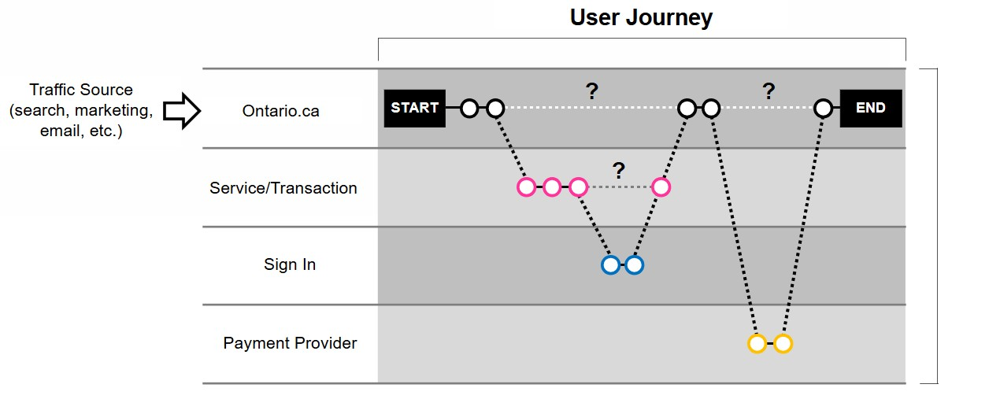
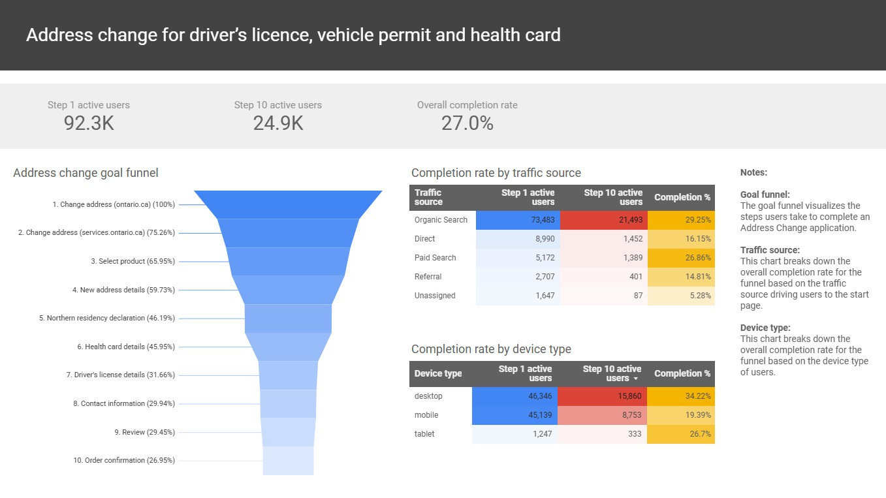
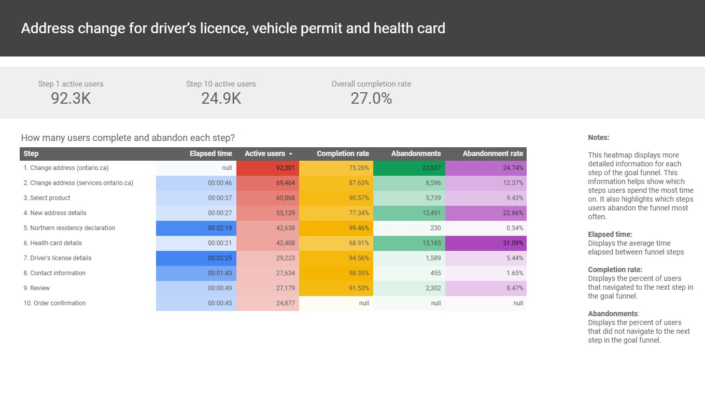

## Enterprise analytics: Tracking Full User Journeys & Optimizing Conversions

### Summary:

I led an enterprise initiative to implement a unified analytics system across all public facing Ontario.ca services, establishing a single, secure view of the end-to-end user journey. This involved configuring advanced cross-domain tracking, implementing GTM, and authoring a 67-page Data Privacy Impact Assessment (PIA) to standardize compliance. The platform now delivers deep insights into user movements and service drop-off points, standardizing data for product teams and executives.

View a sample PDF export of the <a href="{{ '/assets/goal-funnel-report.pdf' | relative_url }}" target="_blank" rel="noopener noreferrer">
  Address Change goal funnel report
</a>

### Tools used:

- **Google Tag Manager (GTM)** – Enterprise-level container ownership and configuration
- **Google Analytics 4** – Destination platform for consolidated web and product data
- **Data Layer** – Standardized data model used for tagging and data transmission
- **Data Privacy Impact Assessment (PIA)** – Comprehensive governance documentation and standardized privacy protocol
- **Looker Studio** – For data visualization and reporting on end-to-end user flows
- **HTML, JavaScript, and CSS** – For data layer manipulation and site tag implementation

### Purpose of the work:

The goal was to **eliminate data fragmentation** and provide actionable, end-to-end user journey insights across government services. While the user views Ontario.ca and related services as a single entity, the underlying technology stack and governance structure resulted in siloed analytics.

This project achieved:

- **Improved service delivery** by measuring macro-level performance metrics, such as completion rates.
- **Accurate ROI measurement** for digital marketing by tracking users from the Ontario.ca landing page through to transaction completion.
- **Standardization of data, privacy, and security** practices, mitigating the risk of sensitive PII collection.
- **Reduced duplication of effort** by centralizing skill sets and providing a compliant analytics framework.

### Key project phases:

**1. Governance and Privacy Standardization**
   
I authored and secured approval for the 67-page PIA, which standardized rules for cross-domain tracking and data collection. This centralized approach drastically reduced the compliance burden on product teams, ensuring all data collection was secure and privacy-focused.

**2. Technical Implementation: GTM, Data Layer, and Cross-Domain Tagging**

I configured GTM containers across all ontario.ca domains, implementing a best-in-class data layer strategy to structure key user information (e.g., completion status, attribution) and ensure consistent data integrity in GA4. I then implemented linker parameters and domain configurations within GTM to maintain intact user sessions across ontario.ca and separate service domains, enabling a unified journey view.

**3. Data Visualization and Marketing Impact**

I collaborated with marketing and product teams to define high-value service completions as GA4 Key Events. These were strategically passed to Google Ads to improve automated bidding, targeting, and overall campaign performance. To visualize the cross-domain success, I created Looker Studio reports that mapped the full goal funnel for top Service Ontario applications, demonstrating drop-off points across different government domains for optimization.

### Results and impact

This initiative established the foundation for data standardization, ensuring that product teams, senior executives, and program areas have a consistent, privacy-focused understanding of service performance.

Key outcomes include:

- **30% increase in marketing spend efficiency** by connecting tracked GA4 conversions to Google Ads as key events, improving campaign performance and targeting.
- **Demonstration of Cross-Domain Success:** Developed an end-to-end goal funnel report in Looker Studio for the "Address change" application, spanning the critical ontario.ca and services.ontario.ca domains.
- **90% reduction** in product team effort for privacy and data standardization work.
- **Clearer, unified view** of user movement between Ontario.ca and services.ontario.ca, enabling path optimization.
- **Stronger standards** for data governance, privacy, and security.

### Project resources
- <a href="{{ '/assets/goal-funnel-report.pdf' | relative_url }}" target="_blank" rel="noopener noreferrer">
  PDF export of the Address Change goal funnel report
</a>

- <a href="{{ '/assets/ga4-privacy-assessment.pdf' | relative_url }}" target="_blank" rel="noopener noreferrer">
  PDF export of the GA4 Privacy Impact Assessment
</a>

