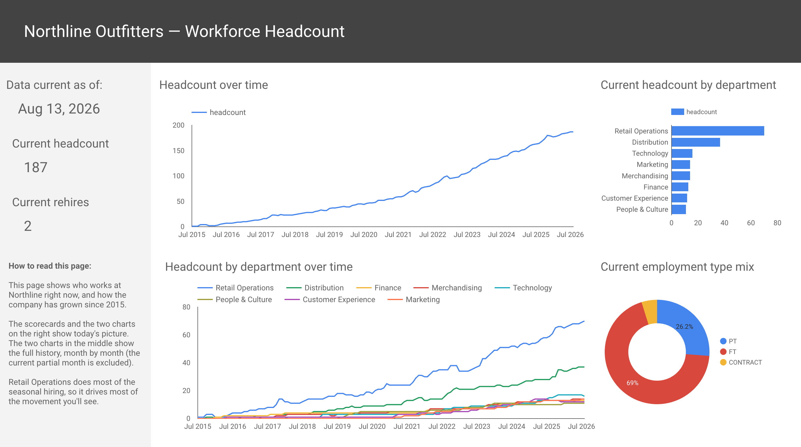
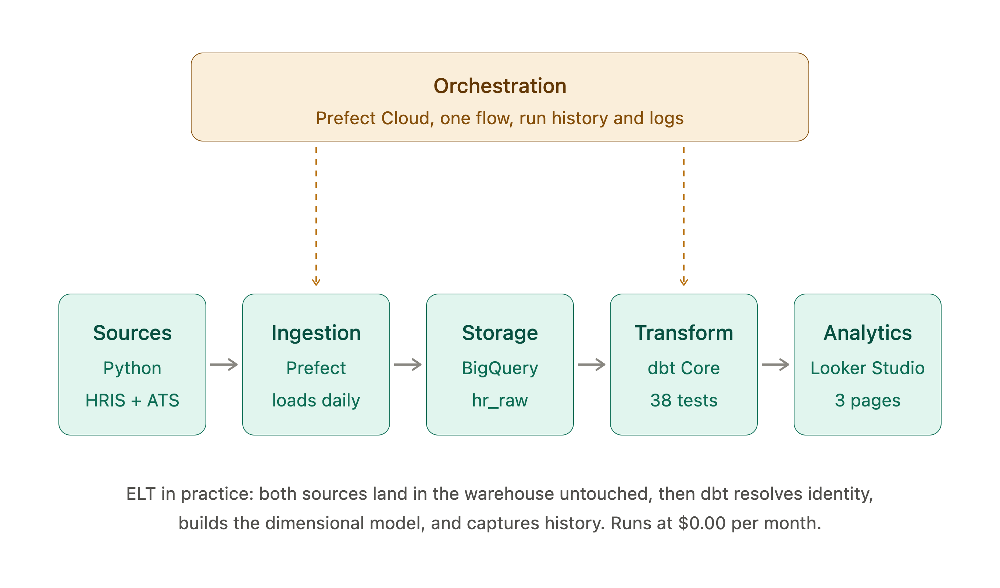
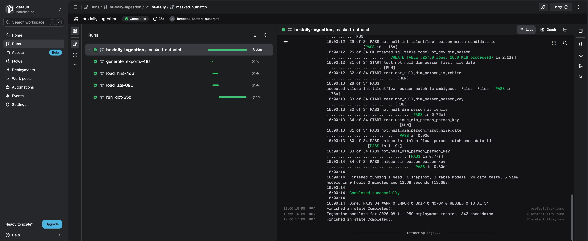
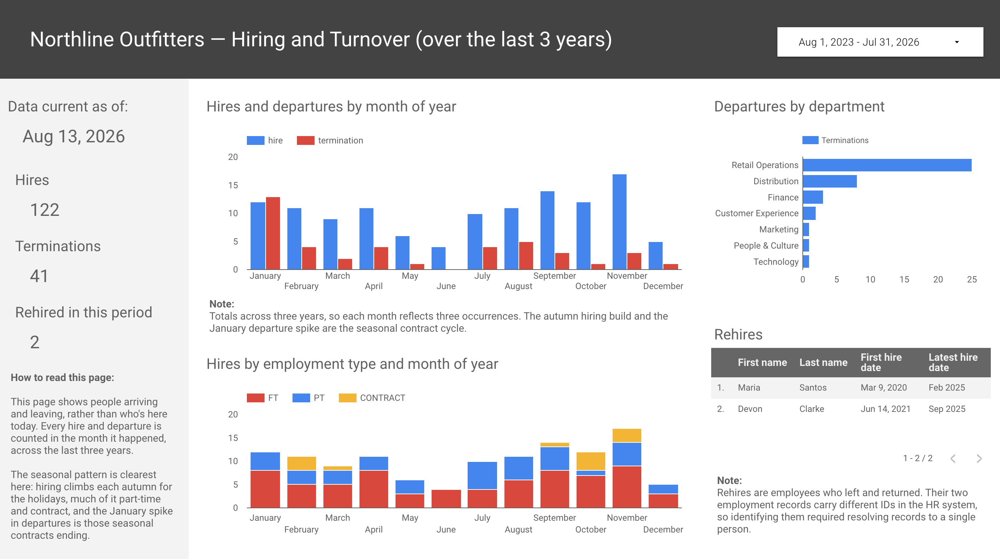
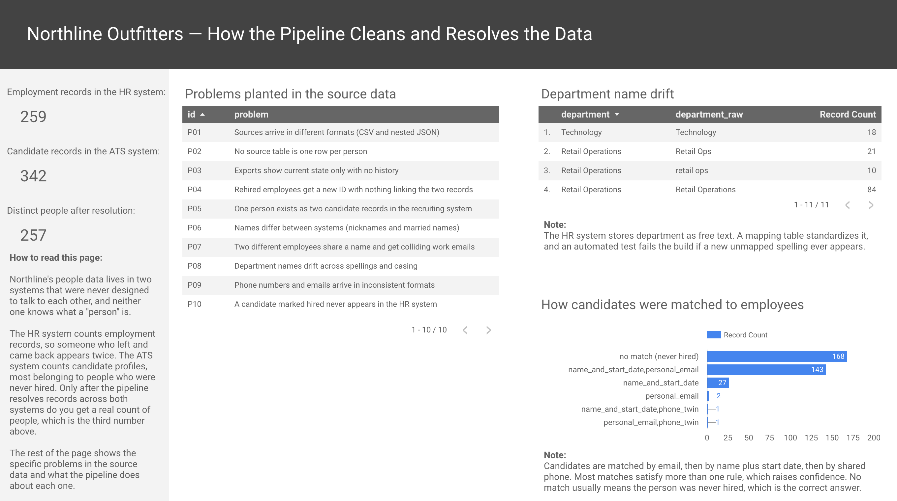

# People analytics engineering: Building one employee record from two systems that disagree

### Summary

I built a pipeline to join conflicting information from a company's HR and ATS systems and answer how many people actually work there (the golden record problem). Two generated data sources export mismatched data every day. The pipeline sends both data sources to a warehouse and resolves them into a single record for each person. A dimensional model feeds the data into a dashboard answering questions on headcount and turnover. It runs through Prefect, tests itself on every build, and costs $0.00 per month.



- [Live dashboard](ADD_LINK)
- [GitHub repository](ADD_LINK)

### Why I built this

This project demonstrates building a data pipeline across two source systems that contradict each other.

- **Identity resolution.** The main challenge in this project was deciding whether two records describe the same human being or not. Data models in the pipeline were designed to solve this, along with other data quality problems built into the source systems.

- **Real orchestration.** This project uses Prefect to orchestrate the pipeline and guarantee transformation runs only after ingestion succeeds. Previous projects I've worked on relied on cron jobs.

- **Dimensional modelling and history.** The source systems only ever show the present. This project uses dbt snapshots and slowly changing dimension type 2 patterns to build history as the pipeline runs, which makes it possible to answer questions like "what was the headcount by department last March?"

### How it works

I structured the project around the standard components of modern data infrastructure, following the ELT approach: land raw data in the warehouse first, then transform it there.



**1. Data sources.** Real HR data is private and heavily regulated, so two Python scripts simulate the systems a mid sized company would actually have.

*PeopleCore* is the HRIS, the system of record for employment. It exports a nightly CSV with one row per employment record:

| employee_id | first_name | last_name | department | job_title | hire_date | termination_date | status |
|---|---|---|---|---|---|---|---|
| E-01125 | Maria | Santos | Retail Operations | Shift Supervisor | 2020-03-09 | 2023-08-18 | Terminated |
| E-01479 | Maria | Santos | Retail Ops | Assistant Store Manager | 2025-02-03 | | Active |

Those two rows are the same person. PeopleCore does not know that, because HR systems track employment records rather than people, and a rehire gets a brand new ID. Note the department is also spelled two different ways.

*TalentFlow* is the ATS recruiting system. It exports JSON with applications nested inside each candidate:

```json
{
  "candidate_id": "cand_nd6j0",
  "first_name": "Rob",
  "last_name": "Chen",
  "personal_email": "robert.chen@gmail.com",
  "phone": "+1 905 423 5920",
  "applications": [
    {
      "application_id": "app_x92m1",
      "job_title": "Merchandising Coordinator",
      "status": "hired",
      "offer": { "accepted_at": "2023-05-02", "start_date": "2023-05-15" }
    }
  ]
}
```

This system has no employee ID and no work email, because it collects self reported information from people before they are employees. For example, here it has "Rob" where the HR system has "Robert."

**2. Ingestion.** A Prefect flow runs both python generators, then loads the CSV and the JSON into BigQuery in parallel. The raw tables are full replacements of each nightly export, matching how the source systems actually behave.

**3. Storage.** BigQuery acts as the warehouse. Raw data lands untouched in its own dataset, so any problem can be traced cleanly to either ingestion or transformation. The nested JSON stays nested.

**4. Transformation and modelling.** This is the analytics engineering core.

A *staging layer* cleans and standardizes both data sources. Data types are cast, emails are lowercased, phone numbers are stripped to ten digits, blanks become proper nulls, and department spellings are standardized against a mapping table. The nested JSON data from the ATS system is unnested into two tables for candidates and applications, since they are a different grain.

An *intermediate layer* builds a unique person key. It first links employment records to each other, then matches candidates across to them using a ranked list of rules:

- personal email
- name plus an aligned start date
- shared phone and name

Every match records which rules fired, so the reasoning is documented. Candidates that match nothing keep a null key. This correctly identifies the roughly 170 candidate records with no employment match, most of whom applied and were never hired.

A *mart layer* builds the star schema, the tables the dashboard actually reads. A star schema puts one fact table in the middle surrounded by dimension tables. The fact records events, and the dimensions describe them.

My employment events fact adds a row every time someone is hired or leaves. It connects to three dimensions: the person the event happened to, the department they were in, and the date it happened. So a question like "how many people left Retail Operations last January" becomes a single query against the fact table and its date dimension.

A *snapshot* captures changes over time, so when someone transfers departments the pipeline records both versions with the dates each was true. This is what makes point in time questions possible to answer, because the source exports only show the present.


**5. Orchestration.** One Prefect flow runs the whole sequence. It generates the day's exports, loads both sources, then runs the full dbt build. Prefect Cloud provides run history, task level timing, and logs.



**6. Analytics and visualization.** A three page Looker Studio dashboard. Page one covers current headcount and how the company has grown since 2015. Page two covers hiring and departures, where the seasonal retail pattern is clearest. Page three explains the data quality work, showing the planted problems and how each is handled, so a reader can see what the pipeline is actually doing.



### A problem I solved along the way

**A dashboard that reported 284,814 employees.** The headcount table stored the total number of employees the company had on each day. So when the dashboard added it up across every date, it counted each person once for every day they worked.

Rather than creating calculated fields directly in the BI tool, I built two purposefully designed aggregate fact tables underneath it. One holds month end snapshots, and one holds only the current day. This made the monthly headcount chart easy to build, and made the original mistake impossible to repeat.

### SQL example: counting headcount for each day in the company's history

Our HR system only gives us present day information. In this example I joined a date spine to the HR records to answer "how many people worked here last March?"

```sql
select
    dim_date.date_day,
    count(*) as headcount
from dim_date
inner join stg_peoplecore__employees as employees
    on employees.hire_date <= dim_date.date_day
    and (
        employees.termination_date is null
        or employees.termination_date > dim_date.date_day
    )
group by dim_date.date_day
```

`dim_date` is a date spine, a table with one row for every calendar day since the company started. `stg_peoplecore__employees` is the cleaned HR export, one row per employment record with a hire date and a termination date.

This SQL example uses an inner join to match the employee count based on a range of dates. Take March 15, 2024 as an example. The join finds everyone hired on or before that date who either hadn't left yet or left afterward. Counting them gives that day's headcount.

This table stores the full headcount of the company for each day. Two smaller tables are built from it to feed the dashboard accurately. One table holds month end snapshots for trends, and one table holds only the current day employee count for the scorecards.

### Results

- **Rehire numbers leadership can trust.** Rehired employees show up twice in the HR system with unrelated IDs. Resolving them to one person means tenure counts from someone's real first day and returning employees are visible as a metric.

- **Documenting how people are matched across source systems.** Every candidate carries a record of which rules identified them. Most matches satisfy more than one rule independently, which raises confidence they are the same person.

- **Real dependency based orchestration.** One flow, ordered by structure rather than a timing buffer, with run history and logs in Prefect Cloud.

- **Zero cost.** The full system runs at $0.00 per month across BigQuery, Prefect Cloud, and Looker Studio free tiers.



### Links

- [Live dashboard](ADD_LINK)
- [GitHub repository](ADD_LINK)
